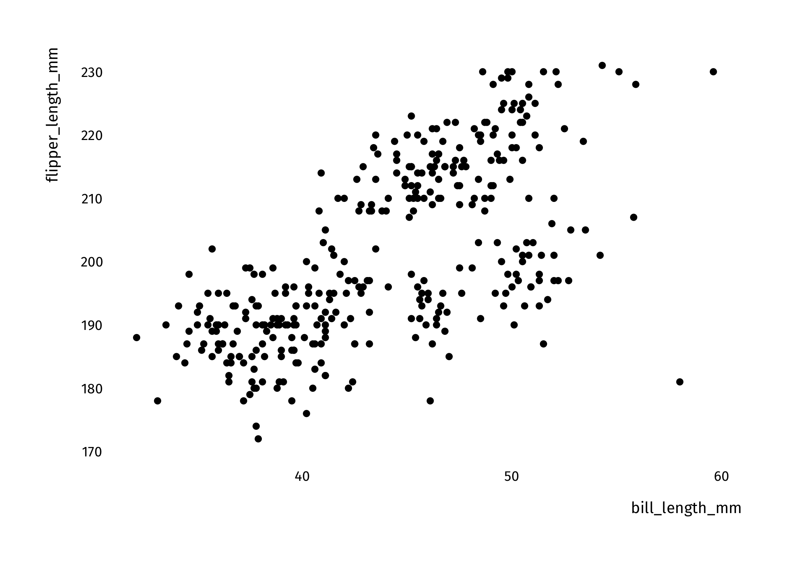

<!-- README.md is generated from README.Rmd. Please edit that file -->

# tools42

<!-- badges: start -->
<!-- badges: end -->

The goal of tools42 is to make life easier for folks at ideas42 who are
doing analytical work. While this is a work in progress, our goal is to
include features like:

-   Simple plotting functions for exploratory data analysis using
    `ggplot2`
-   Helper functions for data cleaning, wrangling, and analysis
-   Templates for projects, reports, and briefs
-   Themes for publication-ready figures
-   Functions to help you export data and results in accessible formats
-   et cetera

## Installation

You can install the development version from
[GitHub](https://github.com/) with:

``` r
# install.packages("devtools")
devtools::install_github("ideas42/tools42")
```

## Plots

This is a basic example which shows you how to solve a common problem:
plotting your data. Let’s start with a scatterplot and histogram.

``` r
library(tools42)

## Plotting a histogram of penguin bill length

viz_hist(penguins, bill_length_mm) +
  theme_42()
#> `stat_bin()` using `bins = 30`. Pick better value with `binwidth`.
#> Warning: Removed 2 rows containing non-finite values (stat_bin).
```


``` r
## Simple scatterplot

viz_scatter(penguins, bill_length_mm, flipper_length_mm) +
  theme_42()
#> Warning: Removed 2 rows containing missing values (geom_point).
```



## Themes

As you saw in the last section, we also have some themes. These are
designed to make your plots looks nicer, and so far there’s two of them.
The first, `theme_42`, is a simple, clean, theme that minimizes clutter.

``` r
library(ggplot2)

viz_scatter(penguins, bill_length_mm, flipper_length_mm) + 
  labs(title = "This is a sample plot",
       subtitle = "And this is the subtitle") +
  theme_42()
#> Warning: Removed 2 rows containing missing values (geom_point).
```

 We also have
a brighter, warmer theme. To use it, just add `theme_42_bright` to your
call. This can be used with the helper functions `viz_*` as well as with
regular `ggplot` calls:

``` r
ggplot(penguins, aes(bill_length_mm, flipper_length_mm)) + 
  geom_point() +
  labs(title = "This is a sample plot",
       subtitle = "And this is the subtitle") +
  theme_42_bright()
#> Warning: Removed 2 rows containing missing values (geom_point).
```


## Color schemes

Lastly, we’ve created some color schemes for you. There’s two palettes:
`i42`, and `i42_bright`. To visualize them, just use the `palette_42`
function.

``` r
palette_42("i42_bright")
```


Here’s what it looks like when we combine it with a previous plot.

``` r
ggplot(penguins, aes(bill_length_mm, flipper_length_mm, color = species)) + 
  geom_point() +
  labs(title = "This is a sample plot",
       subtitle = "And this is the subtitle") +
  theme_42_bright() +
  scale_color_manual(values = palette_42("i42_bright"))
#> Warning: Removed 2 rows containing missing values (geom_point).
```


