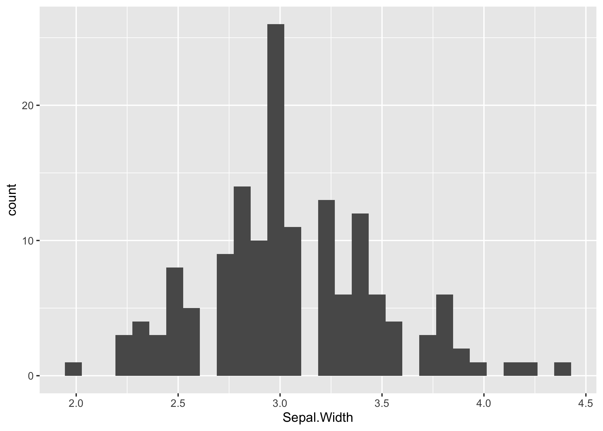
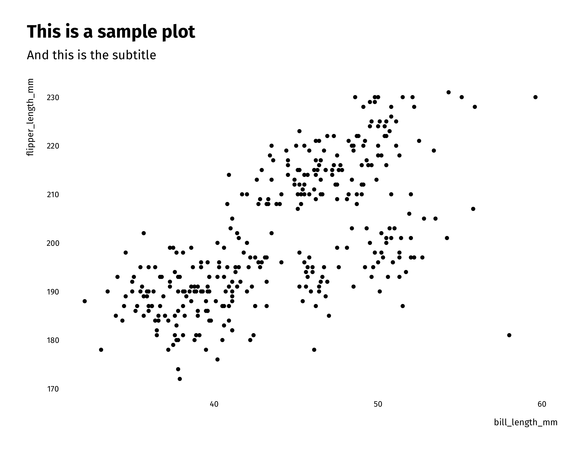

<!-- README.md is generated from README.Rmd. Please edit that file -->

# tools42

<!-- badges: start -->
<!-- badges: end -->

The goal of tools42 is to make life easier for folks at ideas42 who are
doing analytical work. While this is a work in progress, our goal is to
include features like:

-   Simple plotting functions for exploratory data analysis using
    `ggplot2`
-   Helper functions for data cleaning, wrangling, and analysis
-   Templates for projects, reports, and briefs
-   Themes for publication-ready figures
-   Functions to help you export data and results in accessible formats

## Installation

You can install the development version from
[GitHub](https://github.com/) with:

``` r
# install.packages("devtools")
devtools::install_github("ideas42/tools42")
```

## Example

This is a basic example which shows you how to solve a common problem:

``` r
library(tools42)
## basic example code

viz_hist(iris, "Sepal.Width")
#> `stat_bin()` using `bins = 30`. Pick better value with `binwidth`.
```



Let’s try using our theme now:

``` r
library(ggplot2)

ggplot(iris, aes(Sepal.Width, Sepal.Length)) + 
  geom_point() +
  labs(title = "This is a sample plot",
       subtitle = "And this is the subtitle") +
  theme_42()
```


